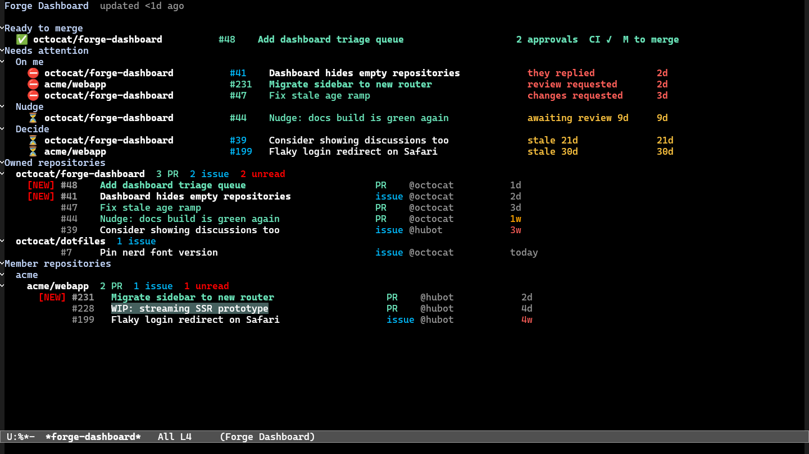

# forge-dashboard

A triage-oriented dashboard for [Forge](https://github.com/magit/forge):
one buffer answering what is ready to merge, what is blocked on you,
and what has gone stale — triageable in one or two keystrokes per item.



All data comes from Forge's local SQLite database (read-only). Nothing
touches the network except an explicit refresh via the existing Forge
pull commands.

## Sections

From top to bottom, the `*forge-dashboard*` buffer shows:

- **Ready to merge** — ✅ rows with approval count and an informational
  CI badge, plus an `M to merge` hint.
- **Needs attention** — grouped as **On me** (⛔), **Nudge** (⏳), and
  **Decide** (⏳), each row naming the reason (`changes requested`,
  `they replied`, `review requested`, `awaiting review 9d`, `stale 21d`).
- **Owned repositories** — repos owned by your githost login (or listed
  in Forge's `forge-owned-accounts`), with open PR / issue / unread
  counts and the newest topics inline.
- **Member repositories** — repos where your login is among the
  assignable users (plus `forge-dashboard-organizations` overrides),
  grouped by owner.

Topic rows carry a `[NEW]` badge when unread and an age label with a
color ramp (fresh → aging over 7 days → stale). Draft pull requests use
Forge's draft face.

## Attention states

| Badge | State               | Meaning                                                                                                                             |
|-------|---------------------|-------------------------------------------------------------------------------------------------------------------------------------|
| ✅    | `ready-to-merge`    | My PR (or a PR in an owned repo): ≥1 approval, no `CHANGES_REQUESTED`, not a draft, no merge conflict. CI is shown but never gates. |
| ⛔    | `changes-requested` | My PR whose latest review requests changes.                                                                                         |
| ⛔    | `they-replied`      | My topic with a reply from someone else, still unread/pending.                                                                      |
| ⛔    | `review-requested`  | I am a requested reviewer and haven't reviewed yet.                                                                                 |
| ⏳    | `awaiting-review`   | My PR with no review activity for `forge-dashboard-awaiting-review-after` days (7).                                                 |
| ⏳    | `stale`             | No activity for `forge-dashboard-stale-after` days (14).                                                                            |

Items are urgency-sorted: ready first, then blocked on you, then stale.
Rules degrade gracefully per host: missing data (e.g. no CI or review
state in the db) simply doesn't trigger the rule.

## Requirements

- Emacs 29+
- Forge 0.5.x, Magit, Transient (plus their dependencies: Closql,
  Emacsql, Ghub, …)

## Installation

Clone next to Forge and add both to your `load-path`, e.g. with
`use-package`:

```elisp
(use-package forge-dashboard
  :load-path ("~/src/forge-dashboard" "~/src/forge/lisp")
  :commands (forge-dashboard))
```

## Usage

`M-x forge-dashboard` opens the dashboard.

Dashboard keys:

| Key       | Action                                                       |
|-----------|--------------------------------------------------------------|
| `RET`     | Visit topic (or list the repository's topics)                |
| `b`       | Browse topic or repository in a browser                      |
| `y`       | Copy topic or repository URL                                 |
| `g` / `G` | Refresh from the local db / pull each dashboard repo         |
| `t`       | Start linear triage over the attention queue                 |
| `z` / `d` | Snooze topic / mark done until new activity                  |
| `C`       | Nudge with a pre-filled comment template                     |
| `M`       | Merge (ready rows only)                                      |
| `?`       | Dashboard menu: section toggles, type filter, per-repo limit |

Triage (`t`) walks the queue one item at a time: `M` merge, `RET`
visit, `b` browse, `c` check out the PR, `C` comment from
`forge-dashboard-nudge-templates`, `z` snooze (1d/3d/1w/custom),
`d` done, `x` close, `SPC` skip, `n`/`p` switch pages (`All`,
`Ready to merge`, and one page per attention group), `q` quit.

Snooze/done marks live in a small local SQLite store
(`forge-dashboard-triage-file`) and never touch the forge database.

## Customization

- `forge-dashboard-organizations` — extra owners counted as member
  repositories (for repos whose assignee data hasn't synced).
- `forge-dashboard-topics-per-repo` — max topics per repo (`nil` shows
  all; repositories start collapsed).
- `forge-dashboard-stale-after` (14) and
  `forge-dashboard-awaiting-review-after` (7) — day thresholds.
- `forge-dashboard-urgency-weights` — per-state urgency weights.
- `forge-dashboard-attention-groups` — named attention subgroups, which
  also become triage pages.
- `forge-dashboard-nudge-templates` — pre-filled comment texts.

## Development

`make check` byte-compiles (warnings as errors) and runs the focused
ERT suite in `test/`.

## License

GPL-3.0-or-later, see [LICENSE](LICENSE).
